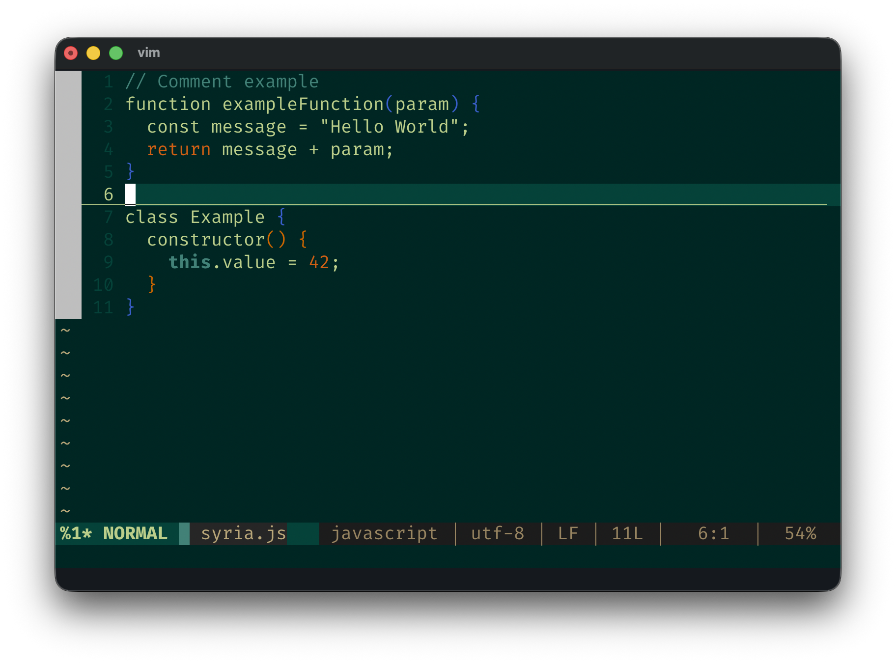
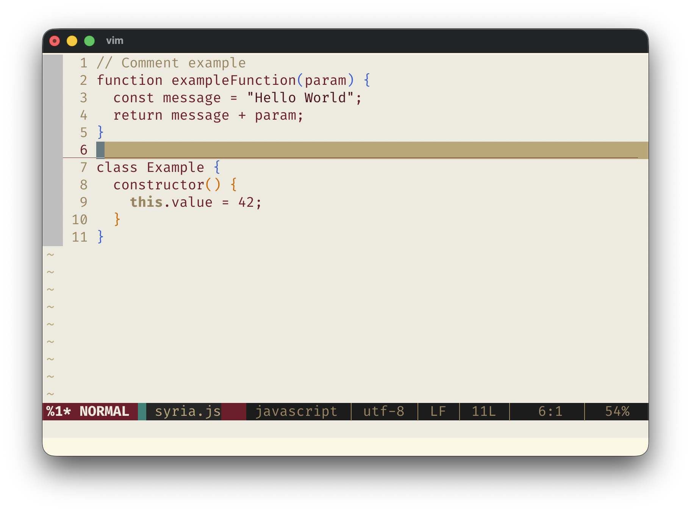
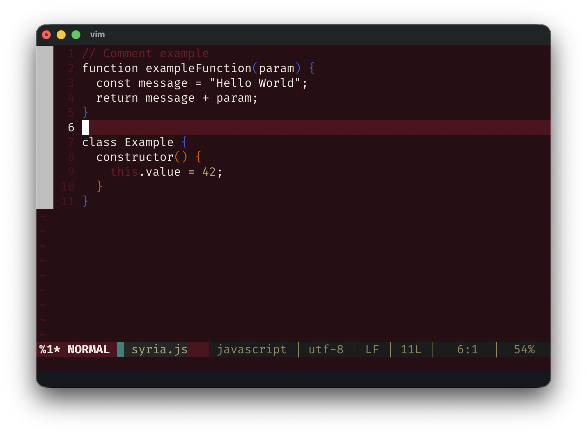
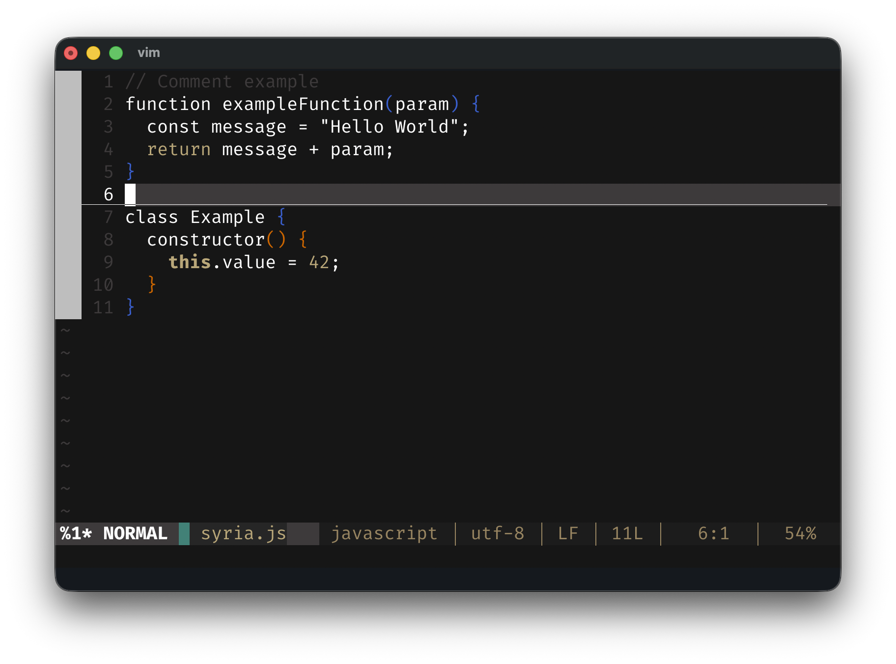

# Syria Vim Themes

Vim color schemes inspired by the [Syrian Visual Identity](https://syrian.zone/syid).

## Themes

| Theme | Description |
|-------|-------------|
| **syria_forest** | Dark theme with natural green tones |
| **syria_golden_wheat** | Light theme with warm, earthy tones |
| **syria_deep_umber** | Dark theme with deep burgundy |
| **syria_charcoal** | Dark theme with neutral grays |

## Screenshots

### Syria Forest


### Syria Golden Wheat


### Syria Deep Umber


### Syria Charcoal


## Color Palettes

### Forest
  

### Golden Wheat
  

### Deep Umber
  

### Charcoal
  

## Installation

### Manual
```sh
mkdir -p ~/.vim/colors
cp colors/*.vim ~/.vim/colors/
```

Add to your `.vimrc`:
```vim
colorscheme syria_forest
```

### vim-plug
```vim
Plug 'latiif/syria-vim-themes'
```

### Vundle
```vim
Plugin 'latiif/syria-vim-themes'
```

### Pathogen
```sh
git clone https://github.com/latiif/syria-vim-themes ~/.vim/bundle/syria-vim-themes
```

## Requirements

- Vim 7.0+ or Neovim
- Terminal with 256-color support
- For best results, enable true colors:
  ```vim
  set termguicolors
  ```

## License

See [LICENSE](LICENSE) file for details.
